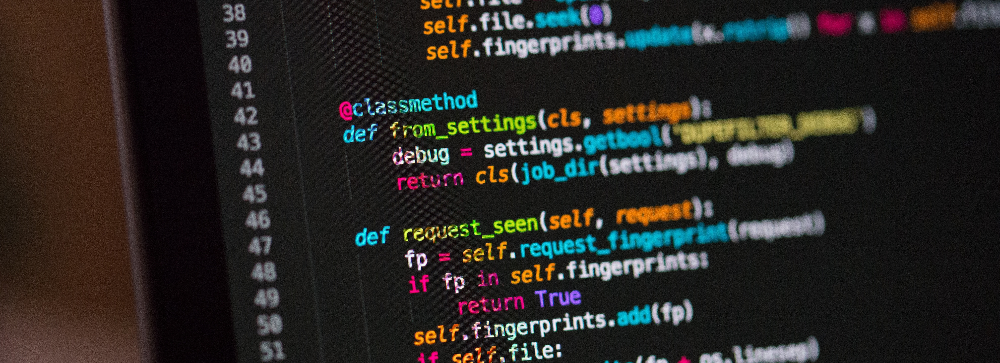
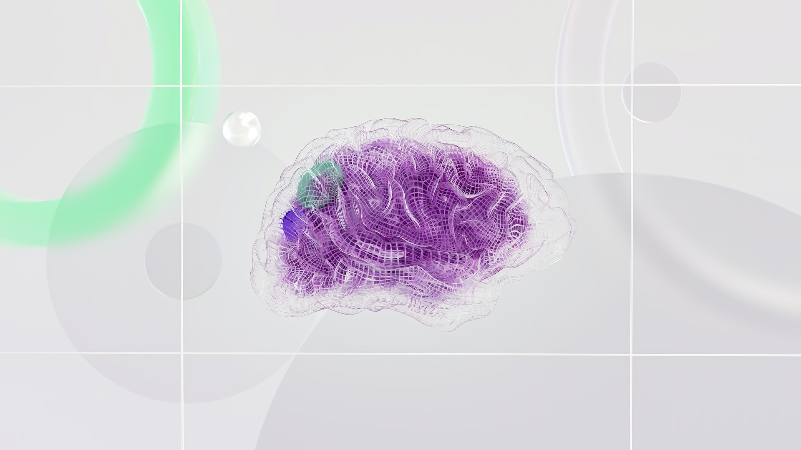
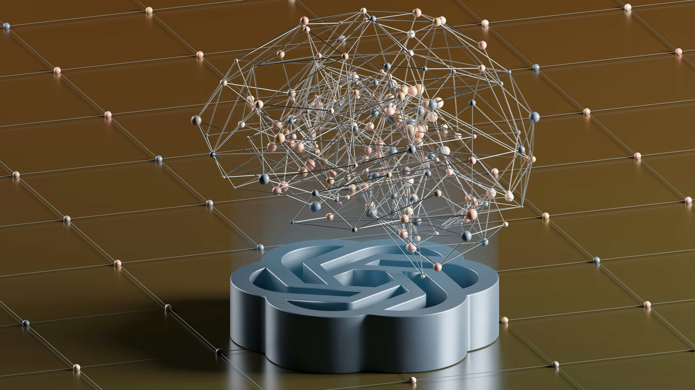

 



Photo by <a href="https://unsplash.com/@cdr6934?utm_source=unsplash&utm_medium=referral&utm_content=creditCopyText">Chris Ried</a> on <a href="https://unsplash.com/photos/ieic5Tq8YMk?utm_source=unsplash&utm_medium=referral&utm_content=creditCopyText">Unsplash</a>

<a></a>

<a href="https://git.io/typing-svg">
    
</a>

```mermaid
graph TD;
    DomainKnowledge[Domain Knowledge]-->MachineLearning[Machine Learning];
    MachineLearning[Machine Learning]-->StatisticalLearning[Statistical Learning];
    MachineLearning[Machine Learning]-->DeepLearning[Deep Learning];
    DomainKnowledge[Domain Knowledge]-->BackendDevelopment[Backend Development];
    DeepLearning[Deep Learning]-->ImageClassification[Image Classification];
    ImageClassification[Image Classification]-->LabelNoise[Label Noise];
    DeepLearning[Deep Learning]-->NaturalLanguageProcessing[Natural Language Processing];
    NaturalLanguageProcessing[Natural Language Processing]-->TopicModeling[Topic Modeling];
    NaturalLanguageProcessing[Natural Language Processing]-->LLMApplication[LLM Application];
    LLMApplication[LLM Application]-->RAG[Retrieval-Augmented Generation];
    LLMApplication[LLM Application]-->AIAgent[AI Agent];
    DeepLearning[Deep Learning]-->Multimodality[Multimodality];
    Multimodality[Multimodality]-->ImageTextClassification[Image-Text Classification];
    Multimodality[Multimodality]-->VisualQuestionAnswering[Visual Question Answering];
   ```

| |Skills|
|-|-|
|**Focus**| |
|**OS**|   |
|**Languages**|![Python](https://img.shields.io/badge/Python-4C8CBF?logo=)   ![C](https://img.shields.io/badge/C-BDE8F7?logo=) |
|**LLM Applications**|  |
|**IDEs**|    |
|**Tools For ML**|     |
|**Tools For DL**|    |
|**Web Deployment**| |
|**Database**| ![MySQL](https://img.shields.io/badge/MySQL-white?logo=) |
|**Version Control**|  |
|**DevOps**|   |
|**Self-developed Package**| [](https://pypi.org/project/mlforce/) |
|**Statistic Tools**|  |
| **Visualization**|  ![Tableau](https://img.shields.io/badge/Tableau-87CEFA?style=flat&logo=) ![PowerBI](https://img.shields.io/badge/-PowerBI-FFF8DC?style=flat&logo=) |

<details>
  <summary><h2>📖 Curriculum Vitae</h2></summary>
    <p>
    <a href="assets/Jiarui_XU_CV.pdf">English</a> | 
    <a href="assets/Jiarui_XU_CV__zh__CN_.pdf">中文版</a>
    </p>
</details>

<details>
  <summary><h2>🌊 Experiences</h2></summary>
  <ul>
    <li>
      Full-time
      <ul>
        <code>LLM Algorithm Engineer</code> &#x40; <img src="https://img.shields.io/badge/Transsion-white?logo=">
          <ul>
            <li>TEX AI</li>
            <li>Built & Optimized Search Agent</li>
            <li>2025.02 ~ Present</li>
          </ul>
      </ul>
    </li>
    <li>
      Research
      <ul>
        <li>
          Interests: Agentic RL / LLM Post-training
        </li>
        <li>
          Projects
          <ul>
            <li>
              Cross-modal medical image representation learning (<u><em>USYD Engineering VRI Scholarship 2024 Winter</em></u>)
            </li>
            <li>
              <em>Top</em>ic <em>M</em>odeling for the <em>E</em>volution through <em>D</em>escriptions of <em>A</em>pplications <em>L</em>ongitudina (<em>TopMEDAL</em>)
            </li>
          </ul>
        </li>
      </ul>
    </li>
    <li>
      Internship
      <ul>
        <li>
        <code>LLM Algorithm Intern</code> &#x40; 
          <ul>
            <li>AI Lab</li>
            <li>2024.08 ~ 2024.11</li>
          </ul>
        </li>
      </ul>
      <ul>
        <li>
          <code>Vacation Research Intern</code> &#x40; 
          <ul>
            <li>
              Faculty of Engineering
            </li>
            <li>
              2024.06 ~ 2024.07
            </li>
          </ul>
        </li>
        <li>
          <code>AIGC Algorithm Intern</code> &#x40; 
        </li>
        <ul>
          <li>
            AI Tech
          </li>
          <li>
            2023.12 ~ 2024.02
          </li>
        </ul>
      </ul>
  </ul>
</details>

<details>
  <summary>
    <h2>🚀 Projects</h2>
  </summary>
  <details>
    <summary>
      <h3> <span style="display: inline-block; transform: rotate(220deg);">&#x27A3;</span></h3>
    </summary>
    <p align="center">
      
    </p>
    <p>
      Photo by <a href="https://unsplash.com/@googledeepmind?utm_source=unsplash&utm_medium=referral&utm_content=creditCopyText">Google DeepMind</a> on <a href="https://unsplash.com/photos/LaKwLAmcnBc?utm_source=unsplash&utm_medium=referral&utm_content=creditCopyText">Unsplash</a>
    </p>
    <details>
      <summary id="star-self-developed-library-using-numpy">
        <h3>🌟Self-Developed Library using NumPy</h3><a href="https://github.com/XavierSpycy/MLForce">&#x2197;</a>
      </summary>
      <p>
        My NumPy-based projects have been successfully integrated into my own open-source Python library, named <a href="https://pypi.org/project/mlforce/"><code>MLForce</code></a>. This library is also readily accessible on the <a href="https://pypi.org/project/mlforce">PyPI Community</a>.
      </p>
    </details>
    <details>
      <summary>
        <h3>🌟Multilayer Perceptron from Scratch using NumPy<a href="https://github.com/XavierSpycy/NumPyMultilayerPerceptron">&#x2197;</a></h3>
        <p>
      </summary>
        A robust implementation of multilayer perceptrons, entirely built upon the powerful NumPy library.
        </p>
        <p>Advantages of our implementation:
          <ul>
            <li>
              <details>
                <summary>As simple as Keras</summary>
                <p>
                  <pre><code class="language-python">import numpy_keras as keras</code></pre>
                </p>
              </details>
            </li>
            <li>
              <details>
                <summary>Built-in autograd engine</summary>
                <p>
                  <pre><code class="language-python">import numpy_keras.autograd as keras</code></pre>
                </p>
              </details>
            </li>
            <li>
              <details>
                <summary>Easy to construct</summary>
                <p>
                  <pre><code class="language-python">layers = [
      Input(input_dim=2),
      Dense(units=4, activation='leaky_relu', init='kaiming_normal', init_params={'mode': 'out'}),
      Dense(units=3, activation='hardswish', init='xavier_normal'),
      Dense(units=2, activation='relu', init='kaiming_normal', init_params={'mode': 'in'}),
      Dense(units=1, activation='tanh', init='xavier_uniform')
  ]
  mlp = MultilayerPerceptron(layers)</code></pre>
                </p>
              </details>
            </li>
            <li>
              <details>
                <summary>Stable to train</summary>
                <p>
                  <pre><code class="language-python">mlp.compile(optimizer='Adam',
              metrics=['MeanSquareError'])
  mlp.fit(X, y, epochs=3, batch_size=8, use_progress_bar=True)</code></pre>
                </p>
                <p align="center">
                  
                </p>
                <div align="center" style="font-weight: bold;">
                  Loss
                </div>
              </details>
            </li>
            <li>
              <details>
                <summary>
                  Great results
                </summary>
                <p align="center">
                  
                </p>
                <div align="center" style="font-weight: bold;">
                  Decision boundary
                </div>
              </details>
            </li>
            <li>
              <details>
                <summary>
                  Capability of dealing with complex datasets (10 classes, 128 features, 50,000 samples)
                </summary>
                <p align="center">
                  
                </p>
                <div align="center" style="font-weight: bold;">
                  Smooth optimization procedure in 600 epochs
                </div>
              </details>
            </li>
    </details>

  <details>
    <summary>
      <h3>🌟Non-negative Matrix Factorization using NumPy<a href="https://github.com/XavierSpycy/NumPyNMF">&#x2197;</a></h3>
    </summary>
    <p>
      This project implements nine different Non-negative Matrix Factorization (NMF) algorithms and compares the robustness of each algorithm to five various types of noise in real-world data applications.
    </p>
    <ul>
      <li>
      <details>
        <summary>
          Well-reconstructed effects
        </summary>
        <p align="center">
          
        </p>
        <div align="center" style="font-weight: bold;">
          Image reconstruction
        </div>
      </details>
      </li>
      <li>
      <details>
        <summary>Sufficient experiments</summary>
        <p>
          We conduct a seires of experiments, thus when developing your own algorithms, these results could act as a baseline. The results of the experiments (2 datasets &times; 5 noise types &times; 2 noise levels &times; 5 random seeds implicitly) are displayed in the repository.
        </p>
      </details>
      </li>
      <li>
      <details>
        <summary>Flexible development</summary>
        <p>
          Our development framework empowers you to effortlessly create your own NMF algorithms with minimal Python scripting.
        </p>
      </details>
      </li>
      <li>
      <details>
        <summary>Mature pipeline</summary>
        <p>
          Our framework offers well-established pipelines, accommodating both standard and customized NMF tests. 
        </p>
        <p>
          For personalized NMF models, the <code>nmf</code> parameter accepts a <code>BasicNMF</code> object. You can seamlessly insert your own NMF model into our pipeline to evaluate its performance.
        </p>
      </details>
      </li>
      <li>
      <details>
        <summary>Multiprocessing experiments</summary>
        <p>
          We've harnessed the power of multiprocessing for extensive experiments, significantly enhancing efficiency. This approach has halved the overall experiment duration, reducing it to 30% ~ 50% of the time it would take to run each experiment sequentially.
        </p>
        <p>
          For a comprehensive analysis of your algorithm, our platform enables conducting multiple experiments across various datasets:
        </p>
        <pre><code>from algorithm.pipeline import Experiment

  exp = Experiment()
  exp.choose('L1NormRegularizedNMF')
  exp.execute()</code></pre>
      </details>
      </li>
      <li>
      <details>
        <summary>Interactive algorithm interface</summary>
        <p align="center">
          
        </p>
        <p align="center">
          
        </p>
        <div align="center" style="font-weight: bold;">
          Demo
        </div>
        <p>
          Note that the initial parameter in these experiments can also be <code>BasicNMF</code> object, allowing the direct integration of your custom NMF model for thorough evaluation and testing.
        </p>
      </details>
      </li>
    </ul>
  <b>
    DON'T HESITATE TO DEVELOP YOUR OWN ALGORITHM!!!
  </b>
  </details>
  </details>
  <details>
    <summary>
      <h3> <span style="display: inline-block; transform: rotate(220deg);">&#x27A3;</span></h3>
    </summary>
    <p align="center">
      
    </p>
    Photo by <a href="https://unsplash.com/@agk42?utm_content=creditCopyText&utm_medium=referral&utm_source=unsplash">Alex Knight</a> on <a href="https://unsplash.com/photos/white-robot-near-brown-wall-2EJCSULRwC8?utm_content=creditCopyText&utm_medium=referral&utm_source=unsplash">Unsplash</a>
    <details>
      <summary id="star-emnist-handwritten-character-classification">
        <h3>🌟EMNIST Handwritten Character Classification</h3><a href="https://github.com/XavierSpycy/EMNIST-Classifier">&#x2197;</a>
      </summary>
      <p>
        This project aims to reproduce various convolutional neural networks and modify them to our specific requirements.
      </p>
      <div align="center">
    <table style="text-align: center;">
      <caption>Performance of different CNNs on the training set</caption>
      <tr>
        <td></td>
        <td align="center">AlexNet</td>
        <td align="center">VGGNet</td>
        <td align="center">SpinalNet</td>
        <td align="center">ResNet</td>
      </tr>
      <tr>
        <td align="center">Accuracy</td>
        <td align="center">87.95%</td>
        <td align="center">89.80%</td>
        <td align="center">87.15%</td>
        <td align="center">89.28%</td>
      </tr>
      <tr>
        <td align="center">Precision</td>
        <td align="center">87.62%</td>
        <td align="center">90.01%</td>
        <td align="center">86.18%</td>
        <td align="center">89.24%</td>
      </tr>
      <tr>
        <td align="center">Recall</td>
        <td align="center">87.95%</td>
        <td align="center">89.80%</td>
        <td align="center">87.15%</td>
        <td align="center">89.28%</td>
      </tr>
      <tr>
        <td align="center">F1 score</td>
        <td align="center">86.59%</td>
        <td align="center">88.42%</td>
        <td align="center">85.28%</td>
        <td align="center">88.30%</td>
      </tr>
    </table>
    </div>
    <div align="center">
    <table style="text-align: center;">
      <caption>Performance of different CNNs on the test set</caption>
      <tr>
        <td></td>
        <td align="center">AlexNet</td>
        <td align="center">VGGNet</td>
        <td align="center">SpinalNet</td>
        <td align="center">ResNet</td>
      </tr>
      <tr>
        <td align="center">Accuracy</td>
        <td align="center">86.96%</td>
        <td align="center">87.24%</td>
        <td align="center">85.92%</td>
        <td align="center">86.88%</td>
      </tr>
      <tr>
        <td align="center">Precision</td>
        <td align="center">85.55%</td>
        <td align="center">86.43%</td>
        <td align="center">85.92%</td>
        <td align="center">86.88%</td>
      </tr>
      <tr>
        <td align="center">Recall</td>
        <td align="center">86.96%</td>
        <td align="center">87.24%</td>
        <td align="center">85.92%</td>
        <td align="center">86.88%</td>
      </tr>
      <tr>
        <td align="center">F1 score</td>
        <td align="center">85.58%</td>
        <td align="center">85.66%</td>
        <td align="center">84.07%</td>
        <td align="center">85.68%</td>
      </tr>
    </table>
    </div>
    <p align="center">
      
    </p>
    <div align="center" style="font-weight: bold;">
      Effects of VGGNet
    </div>
    </details>
    <details>
    <summary>
      <h3>🌟CAT: A Visual-Text Multimodal Classifier</h3><a href="https://github.com/XavierSpycy/CAT-ImageTextIntegrator">&#x2197;</a>
    </summary>
    <p>
      This project involves a multi-label multi-classification problem. We deployed four pre-trained image models and two pre-trained text models. To enhance performance, we developed 12 multi-modal models using self-attention and cross-attention mechanisms. The project poster showcases some valuable techniques and intriguing discoveries.
    </p>
    <p align="center">
      
    </p>
    <div align="center" style="font-weight: bold;">
      CAT (Convolution, Attention and Transformer) architecture
    </div>
    <p align="center">
      
    </p>
    <div align="center" style="font-weight: bold;">
      Project Poster
    </div>
  </details>
  <details>
    <summary>
      <h3>🌟Robust Traniners for Noisy Labels</h3><a href="https://github.com/XavierSpycy/Robust-Trainers-for-Noisy-Labels">&#x2197;</a>
    </summary>
    <p>
      This project is an experimental repository focusing on dealing with datasets containing a high level of noisy labels (50% and above). This repository features experiments conducted on the <code>FashionMNIST</code> and <code>CIFAR</code> datasets using the <code>ResNet34</code> as the baseline classifier.
    </p>
    <p>
      The repository explores various training strategies (<code>Trainer</code> objects), including <code>ForwardLossCorrection</code>, <code>CoTeaching</code>, <code>JoCoR</code>, and <code>O2UNet</code>. Specifically, for datasets with unknown transition matrices, <code>DualT</code> is employed as the Transition Matrix Estimator.
    </p>
    <ul>
      <li>
        <details>
          <summary>Meaningful Loss Trends</summary>
          <p align="center">
            
          </p>
          <div align="center" style="font-weight: bold;">
            Loss Trend 1
          </div>
          <p align="center">
            
          </p>
          <div align="center" style="font-weight: bold;">
            Loss Trend 2
          </div>
        </details>
      </li>
      <li>
        <details>
          <summary>Persuasive Results</summary>
          <div align="center">
            <h5>FashionMNIST0.5</h5>
              <table>
                <tr>
                  <th colspan="3">Actual Transition Matrix</th>
                  <th colspan="3">Estimated Transition Matrix</th>
                </tr>
                <tr>
                  <td>0.5</td><td>0.2</td><td>0.3</td><td>0.473</td><td>0.209</td><td>0.309</td>
                </tr>
                <tr>
                  <td>0.3</td><td>0.5</td><td>0.2</td><td>0.306</td><td>0.485</td><td>0.232</td>
                </tr>
                <tr>
                  <td>0.2</td><td>0.3</td><td>0.5</td><td>0.221</td><td>0.306</td><td>0.460</td>
                </tr>
              </table>
          </div>
          <div align="center">
            <h5>FashionMNIST0.6</h5>
              <table>
                <tr>
                    <th colspan="3">Actual Transition Matrix</th>
                    <th colspan="3">Estimated Transition Matrix</th>
                </tr>
                <tr>
                  <td>0.4</td><td>0.3</td><td>0.3</td><td>0.407</td><td>0.295</td><td>0.298</td>
                </tr>
                <tr>
                  <td>0.3</td><td>0.4</td><td>0.3</td><td>0.297</td><td>0.394</td><td>0.308</td>
                </tr>
                <tr>
                  <td>0.3</td><td>0.3</td><td>0.4</td><td>0.301</td><td>0.310</td><td>0.388</td></tr>
                </tr>
              </table>
          </div>
        </details>
      </li>
    </ul>
  </details>
  <details>
    <summary>
      <h3>
        🌟Transformers for Tabular Data<a href="https://github.com/XavierSpycy/tabtransformers">&#x2197;</a>
      </h3>
    </summary>
    <p>
      A PyTorch-based implementation that leverages Transformer architectures to enhance the handling and design of tabular data.
    </p>
  </details>
  <details>
    <summary>
      <h3>🌟MultiCLIP: Multimodal-Multilabel-Multistage Classification using Language Image Pre-training<a href="https://github.com/XavierSpycy/MultiCLIP">&#x2197;</a></h3>
    </summary>
    <p>
      A framework for multimodal-multilabel-multistage classification utilizing advanced pretrained models like CLIP and BLIP. 
    </p>
    <p>
      Diagrams of implementation:
    </p>
    <p align="center">
      
    </p>
    <div align="center" style="font-weight: bold">
      CLIP + Router
    </div>
    <p align="center">
      
    </p>
    <div align="center" style="font-weight: bold">
      BLIP + Anything
    </div>
  </details>
  </details>
    <details>
    <summary>
      <h3> <span style="display: inline-block; transform: rotate(220deg);">&#x27A3;</span></h3>
    </summary>
        <p align="center">
          
        </p>
        <p>
        Photo by <a href="https://unsplash.com/@growtika?utm_content=creditCopyText&utm_medium=referral&utm_source=unsplash">Growtika</a> on <a href="https://unsplash.com/photos/a-computer-generated-image-of-a-network-and-a-laptop-f0JGorLOkw0?utm_content=creditCopyText&utm_medium=referral&utm_source=unsplash">Unsplash</a>
        </p>
        <details>
        <summary>
          <h3>🌟Hands-on LoRa: Practical Fine-tuning LLMs using LoRa<a href="https://github.com/XavierSpycy/hands-on-lora">&#x2197;</a></h3>
        </summary>
        <div align="center" style="font-weight: bold;">
          Completed Showcase of LLMs with LoRa
        </div>
        <div align="center">
          <table style="text-align: center;">
              <tr>
                <td>LLM</td>
                <td>No. Parameters</td>
                <td>Task</td>
                <td>LoRa/QLoRa</td>
                <td>Code</td>
              </tr>
              <tr>
                <td>Gemma-IT</td>
                <td>2B</td>
                <td>Text-to-text Generation</td>
                <td>QLoRa</td>
                <td><a href="https://github.com/XavierSpycy/hands-on-lora/tree/main/examples/gemma_text2text">Link</a></td>
              </tr>
              <tr>
                <td>Qwen 2</td>
                <td>1.5B</td>
                <td>Named Entity Recognition</td>
                <td>LoRa</td>
                <td><a href="https://github.com/XavierSpycy/hands-on-lora/tree/main/examples/qwen_ner">Link</a></td>
              </tr>
              <tr>
                <td>Llama 3</td>
                <td>8B</td>
                <td>Cross-Linguistic Adaptation</td>
                <td>LoRa</td>
                <td><a href="https://github.com/XavierSpycy/hands-on-lora/tree/main/examples/llama_chinese">Link</a></td>
              </tr>
          </table>
        </div>
      </details>
      <details>
        <summary>
          <h3>🌟Llama3Ops: From LoRa to Deployment with Llama3<a href="https://github.com/XavierSpycy/llama-ops">&#x2197;</a></h3>
        </summary>
        <ul>
        <li><u>Model weights</u>: <a href="https://huggingface.co/XavierSpycy/Meta-Llama-3-8B-Instruct-zh-10k">XavierSpycy/Meta-Llama-3-8B-Instruct-zh-10k</a></li>
        <li><u>Finetuning framework</u>: <code>LLaMA-Factory</code> | <code>PEFT</code> | <code>Unsloth</code> </li>
        <li><u>Qauntization framework</u>: <code>llama.cpp</code> | <code>AutoAWQ</code> | <code>AutoGPTQ</code></li>
        <li><u>Deployment framework</u>: <code>llama.cpp</code> | <code>ollama</code> | <code>TensorRT-LLM</code> & <code>Triton</code> | <code>vLLM</code> </li>
        <li><u>RAG framework</u>: <code>LangChain</code> | <code>LlamaIndex</code></li>
        </ul>
      </details>
  </details>
  <details>
    <summary>
      <h3> <span style="display: inline-block; transform: rotate(220deg);">&#x27A3;</span></h3>
    </summary>
      <details>
        <summary>
          <h3>🌟Awesome Tutorials for TensorFlow2<a href="https://github.com/XavierSpycy/Awesome-Tutorials-for-TensorFlow2">&#x2197;</a></h3>
        </summary>
      </details>
  </details>
</details>

<details>
  <summary>
    <h2>📄 Certification</h2>
  </summary>
  <div style="text-align: center;">
    
  </div>
  <div align="center">
      <table>
          <tr>
            <td>Specialization</td><td>Launcher</td><td>Completion Date</td><td>Credential</td>
          </tr>
          <tr>
            <td><b>Generative Adversarial Networks (GANs)</b></td>
            <td>DeepLearning.AI</td>
            <td>Jun 2024</td>
            <td><a href="https://www.coursera.org/account/accomplishments/specialization/certificate/VMERTE79P6FD">Link</a></td>
          </tr>
          <tr>
            <td><b>Natural Language Processing</b></td>
            <td>DeepLearning.AI</td>
            <td>Oct 2023</td>
            <td><a href="https://www.coursera.org/account/accomplishments/specialization/certificate/MGL3LJNX3RZK">Link</a></td>
          </tr>
          <tr>
            <td><b>Deep Learning</b></td>
            <td>DeepLearning.AI</td>
            <td>Aug 2023</td>
            <td><a href="https://www.coursera.org/account/accomplishments/specialization/certificate/MCHWQ64ZN86Q">Link</a></td>
          </tr>
          <tr>
            <td><b>Mathematics for Machine Learning and Data Science</b></td>
            <td>DeepLearning.AI</td>
            <td>Aug 2023</td>
            <td><a href="https://www.coursera.org/account/accomplishments/specialization/certificate/UJQNSGBXB4FL">Link</a></td>
          </tr>
          <tr>
            <td><b>Applied Data Science with Python</b></td>
            <td>University of Michigan</td>
            <td>Jul 2023</td>
            <td><a href="https://www.coursera.org/account/accomplishments/specialization/certificate/S77MYG6WQCUS">Link</a></td>
          </tr>
          <tr>
            <td><b>Machine Learning</b></td>
            <td>DeepLearning.AI & Stanford University</td>
            <td>Jul 2023</td>
            <td><a href="https://www.coursera.org/account/accomplishments/specialization/certificate/GVJJK3HZRSLZ">Link</a></td>
          </tr>
          <tr>
            <td><b>Mathematics for Machine Learning</b></td>
            <td>Imperial College London</td>
            <td>Jun 2023</td>
            <td><a href="https://www.coursera.org/account/accomplishments/specialization/certificate/UHPTL6AM2WHK">Link</a></td>
          </tr>
          <tr>
            <td><b>Expressway to Data Science: Python Programming</b></td>
            <td>University of Colorado Boulder</td>
            <td>Dec 2022</td>
            <td><a href="https://www.coursera.org/account/accomplishments/specialization/certificate/D9N32LL56ZE8">Link</a></td>
          </tr>
          <tr>
            <td><b>Python 3 Programming</b></td>
            <td>University of Michigan</td>
            <td>Dec 2022</td>
            <td><a href="https://www.coursera.org/account/accomplishments/specialization/certificate/5ZZC4LJULZ83">Link</a></td>
          </tr>
          <tr>
            <td><b>Introduction to Scripting in Python</b></td>
            <td>Rice University</td>
            <td>Nov 2022</td>
            <td><a href="https://www.coursera.org/account/accomplishments/specialization/certificate/KN3NPRDUTAFG">Link</a></td>
          </tr>
          <tr>
            <td><b>Statistics with Python</b></td>
            <td>University of Michigan</td>
            <td>Nov 2022</td>
            <td><a href="https://www.coursera.org/account/accomplishments/specialization/certificate/2GDKV3UYSTNU">Link</a></td>
          </tr>
          <tr>
            <td><b>Excel Skills for Data Analytics and Visualization</b></td>
            <td>Macquarie University</td>
            <td>Oct 2022</td>
            <td><a href="https://www.coursera.org/account/accomplishments/specialization/certificate/R9Y9AFUZURMK">Link</a></td>
          </tr>
          <tr>
            <td><b>Python for Everybody</b></td>
            <td>University of Michigan</td>
            <td>Oct 2022</td>
            <td><a href="https://www.coursera.org/account/accomplishments/specialization/certificate/P2L44FCJR9V6">Link</a></td>
          </tr>
          <tr>
            <td><b>Excel Skills for Business</b></td>
            <td>Macquarie University</td>
            <td>Sep 2022</td>
            <td><a href="https://www.coursera.org/account/accomplishments/specialization/certificate/PKTDSLULS3SB">Link</a></td>
          </tr>
        </tr>
      </table>
  </div>
  <details>
    <summary><h3>Credentials</h3></summary>
    <div style="text-align: center;">
      
    </div>
    
    
  </details>
</details>

<details> 
  <summary>
    <h2>☎️ Contact</h2>
  </summary>
  <p>
  If you have any questions or need further information, please don't hesitate to open an issue: <a href="https://github.com/XavierSpycy/XavierSpycy/issues">Ask a Question</a>.
  </p>
  <p align="left">
      <a href="mailto:jixu9182@uni.sydney.edu.au" target="_blank">
          
          jixu9182@uni.sydney.edu.au
      </a>
  </p>
  <p align="left">
      <a href="https://www.linkedin.com/in/jiarui-xu-xavierspycy98" target="_blank">
          
          Jiarui XU
      </a>
  </p>
</details>

<hr style="width: 60%; margin: auto;">
<h2 style="text-align: center;">Thank you for visiting ❤️</h2>