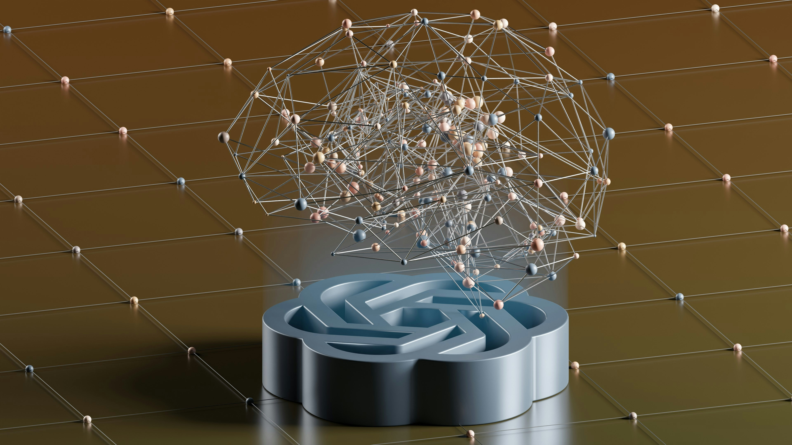

Photo by <a href="https://unsplash.com/@cdr6934?utm_source=unsplash&utm_medium=referral&utm_content=creditCopyText">Chris Ried</a> on <a href="https://unsplash.com/photos/ieic5Tq8YMk?utm_source=unsplash&utm_medium=referral&utm_content=creditCopyText">Unsplash</a>

<a></a>

<a href="https://git.io/typing-svg">
    
</a>

<div style="display: flex; justify-content: center; align-items: center; width: 100%;">
  <a href="https://github.com/anuraghazra/github-readme-stats" style="margin-right: 10px;">
    
  </a>
  <a href="https://github.com/anuraghazra/github-readme-stats">
    
  </a>
</div>

```mermaid
graph TD;
    DomainKnowledge[Domain Knowledge]-->MachineLearning[Machine Learning];
    MachineLearning[Machine Learning]-->StatisticalLearning[Statistical Learning];
    MachineLearning[Machine Learning]-->DeepLearning[Deep Learning];
    DomainKnowledge[Domain Knowledge]-->BackendDevelopment[Backend Development];
    DeepLearning[Deep Learning]-->ImageClassification[Image Classification];
    ImageClassification[Image Classification]-->LabelNoise[Label Noise];
    DeepLearning[Deep Learning]-->NaturalLanguageProcessing[Natural Language Processing];
    NaturalLanguageProcessing[Natural Language Processing]-->TopicModeling[Topic Modeling];
    NaturalLanguageProcessing[Natural Language Processing]-->LLMApplication[LLM Application];
    DeepLearning[Deep Learning]-->Multimodality[Multimodality];
    Multimodality[Multimodality]-->ImageTextClassification[Image-Text Classification];
    Multimodality[Multimodality]-->VisualQuestionAnswering[Visual Question Answering];
   ```

| |Skills|
|-|-|
| **Domain Knownledge**|     |
| **Language**| ![Python](https://img.shields.io/badge/Python-4C8CBF?logo=data:image/svg+xml;base64,PHN2ZyB4bWxucz0iaHR0cDovL3d3dy53My5vcmcvMjAwMC9zdmciIHdpZHRoPSI2NCIgaGVpZ2h0PSI2NCIgdmlld0JveD0iMCAwIDMyIDMyIj48ZGVmcz48bGluZWFyR3JhZGllbnQgaWQ9IkEiIHgxPSI4MTEuNTI3IiB5MT0iNTc0Ljg5NSIgeDI9IjY2NS4yNTUiIHkyPSI1NzMuNzMyIiBncmFkaWVudFVuaXRzPSJ1c2VyU3BhY2VPblVzZSI+PHN0b3Agb2Zmc2V0PSIwIiBzdG9wLWNvbG9yPSIjMzY2YTk2Ii8+PHN0b3Agb2Zmc2V0PSIxIiBzdG9wLWNvbG9yPSIjMzY3OWIwIi8+PC9saW5lYXJHcmFkaWVudD48bGluZWFyR3JhZGllbnQgaWQ9IkIiIHgxPSI4NjIuODI0IiB5MT0iNjQyLjE3NiIgeDI9IjU3My4yNzYiIHkyPSI2NDIuMTc2IiBncmFkaWVudFVuaXRzPSJ1c2VyU3BhY2VPblVzZSI+PHN0b3Agb2Zmc2V0PSIwIiBzdG9wLWNvbG9yPSIjZmZjODM2Ii8+PHN0b3Agb2Zmc2V0PSIxIiBzdG9wLWNvbG9yPSIjZmZlODczIi8+PC9saW5lYXJHcmFkaWVudD48L2RlZnM+PGcgdHJhbnNmb3JtPSJtYXRyaXgoLjE2MTcgMCAwIC4xNTgwODkgLTEwNy41Mzc2NCAtODEuNjYxODcpIj48cGF0aCBkPSJNNzE2LjI1NSA1NDQuNDg3YzAtMTMuNjIzIDMuNjUzLTIxLjAzNCAyMy44MjItMjQuNTYzIDEzLjY5My0yLjQgMzEuMjUtMi43IDQ3LjYyNyAwIDEyLjkzNSAyLjEzNSAyMy44MjIgMTEuNzcgMjMuODIyIDI0LjU2M3Y0NC45NDVjMCAxMy4xODItMTAuNTcgMjMuOTgtMjMuODIyIDIzLjk4aC00Ny42MjdjLTE2LjE2NCAwLTI5Ljc4NyAxMy43ODItMjkuNzg3IDI5LjM2M3YyMS41NjRoLTE2LjM3NmMtMTMuODUyIDAtMjEuOTE3LTkuOTg4LTI1LjMwNS0yMy45NjQtNC41Ny0xOC43NzYtNC4zNzYtMjkuOTYzIDAtNDcuOTQ1IDMuNzk0LTE1LjY4NyAxNS45MTctMjMuOTY0IDI5Ljc3LTIzLjk2NGg2NS41MnYtNmgtNDcuNjQ1di0xNy45OHoiIGZpbGw9InVybCgjQSkiLz48cGF0aCBkPSJNODExLjUyNyA2ODguMzJjMCAxMy42MjMtMTEuODIzIDIwLjUyMy0yMy44MjIgMjMuOTY0LTE4LjA1MiA1LjE4OC0zMi41NCA0LjM5NC00Ny42MjcgMC0xMi42LTMuNjctMjMuODIyLTExLjE3LTIzLjgyMi0yMy45NjR2LTQ0Ljk0NWMwLTEyLjkzNSAxMC43ODItMjMuOTggMjMuODIyLTIzLjk4aDQ3LjYyN2MxNS44NjQgMCAyOS43ODctMTMuNzEgMjkuNzg3LTI5Ljk2M3YtMjAuOTY0aDE3Ljg1OGMxMy44NyAwIDIwLjQgMTAuMzA1IDIzLjgyMiAyMy45NjQgNC43NjQgMTguOTcgNC45NzYgMzMuMTU3IDAgNDcuOTQ1LTQuODE3IDE0LjM2NC05Ljk3IDIzLjk2NC0yMy44MjIgMjMuOTY0SDc2My45djZoNDcuNjI3djE3Ljk4eiIgZmlsbD0idXJsKCNCKSIvPjxwYXRoIGQ9Ik03MjguMTY2IDU0MS41MDVjMC00Ljk3NiAzLjk4OC05IDguOTMtOSA0LjkyMyAwIDguOTMgNC4wMjMgOC45MyA5IDAgNC45Ni00LjAwNiA4Ljk4Mi04LjkzIDguOTgyLTQuOTQgMC04LjkzLTQuMDIzLTguOTMtOC45ODJ6bTUzLjU5IDE0OS43OThjMC00Ljk2IDQuMDA2LTguOTgyIDguOTMtOC45ODIgNC45NCAwIDguOTMgNC4wMjMgOC45MyA4Ljk4MiAwIDQuOTc2LTMuOTg4IDktOC45MyA5LTQuOTIzIDAtOC45My00LjAyMy04LjkzLTl6IiBmaWxsPSIjZmZmIi8+PC9nPjwvc3ZnPg==)|
| **Data Analysis**|    |
| **Databases**| ![MySQL](https://img.shields.io/badge/MySQL-white?logo=data:image/svg+xml;base64,PHN2ZyB4bWxucz0iaHR0cDovL3d3dy53My5vcmcvMjAwMC9zdmciIHdpZHRoPSI2NCIgaGVpZ2h0PSI2NCIgdmlld0JveD0iMCAwIDI1LjYgMjUuNiI+PHBhdGggZD0iTTE3OS4wNzYgOTQuODg2Yy0zLjU2OC0uMS02LjMzNi4yNjgtOC42NTYgMS4yNS0uNjY4LjI3LTEuNzQuMjctMS44MjggMS4xMTYuMzU3LjM1NS40LjkzNi43MTMgMS40MjguNTM1Ljg5MyAxLjQ3MyAyLjA5NiAyLjMyIDIuNzJsMi44NTUgMi4wNTNjMS43NCAxLjA3IDMuNzAzIDEuNjk1IDUuMzk4IDIuNzY2Ljk4Mi42MjUgMS45NjMgMS40MjggMi45NDUgMi4wOTguNS4zNTcuODAzLjkzOCAxLjQyOCAxLjE2di0uMTM1Yy0uMzEyLS40LS40MDItLjk4LS43MTMtMS40MjhsLTEuMzQtMS4yOTNjLTEuMjkzLTEuNzQtMi45LTMuMjU4LTQuNjQtNC41MDYtMS40MjgtLjk4Mi00LjU1LTIuMzItNS4xMy0zLjk3bC0uMDg4LS4xYy45OC0uMSAyLjE0LS40NDcgMy4wNzgtLjcxNSAxLjUxOC0uNCAyLjktLjMxMiA0LjQ2LS43MTNsMi4xNDMtLjYyNXYtLjRjLS44MDMtLjgwMy0xLjM4My0xLjg3NC0yLjIzLTIuNjMyLTIuMjc1LTEuOTYzLTQuNzc1LTMuODgyLTcuMzYzLTUuNDg4LTEuMzgzLS44OTItMy4xNjgtMS40NzMtNC42NC0yLjIzLS41MzctLjI2OC0xLjQyOC0uNDAyLTEuNzQtLjg0OC0uODA1LS45OC0xLjI1LTIuMjc1LTEuODMtMy40MzZsLTMuNjU4LTcuNzYzYy0uODAzLTEuNzQtMS4yOTUtMy40OC0yLjI3NS01LjA4Ni00LjU5Ni03LjU4NS05LjU5NC0xMi4xOC0xNy4yNjgtMTYuNjg3LTEuNjUtLjkzNy0zLjYxMy0xLjM0LTUuNy0xLjgzbC0zLjM0Ni0uMThjLS43MTUtLjMxMi0xLjQyOC0xLjE2LTIuMDUzLTEuNTYyLTIuNTQzLTEuNjA2LTkuMTAyLTUuMDg2LTEwLjk3Ny0uNS0xLjIwNSAyLjkgMS43ODUgNS43NTUgMi44IDcuMjI4Ljc2IDEuMDI2IDEuNzQgMi4xODYgMi4yNzcgMy4zNDYuMy43NTguNCAxLjU2Mi43MTMgMi4zNjUuNzEzIDEuOTYzIDEuMzgzIDQuMTUgMi4zMiA1Ljk4LjUuOTM3IDEuMDI1IDEuOTIgMS42NSAyLjc2Ny4zNTcuNS45ODIuNzE0IDEuMTE1IDEuNTE3LS42MjUuODkzLS42NjggMi4yMy0xLjAyNSAzLjM0Ny0xLjYwNyA1LjA0Mi0uOTgyIDExLjI4OCAxLjI5MyAxNSAuNzE1IDEuMTE1IDIuNCAzLjU3IDQuNjg2IDIuNjMyIDIuMDA4LS44MDMgMS41Ni0zLjM0NiAyLjE0LTUuNTc3LjEzNS0uNTM1LjA0NS0uODkyLjMxMi0xLjI1di4xbDEuODMgMy43MDNjMS4zODMgMi4xODYgMy43OTMgNC40NjIgNS44IDUuOTggMS4wNy44MDMgMS45MTggMi4xODcgMy4yNTYgMi42Nzd2LS4xMzVoLS4wODhjLS4yNjgtLjQtLjY3LS41OC0xLjAyNy0uODkyLS44MDMtLjgwMy0xLjY5NS0xLjc4NS0yLjMyLTIuNjc3LTEuODczLTIuNDk4LTMuNTIzLTUuMjY1LTQuOTk2LTguMTItLjcxNS0xLjM4My0xLjM0LTIuOS0xLjkxOC00LjI4My0uMjctLjUzNi0uMjctMS4zNC0uNzE1LTEuNjA2LS42Ny45OC0xLjY1IDEuODMtMi4xNDMgMy4wMzQtLjg0OCAxLjkxOC0uOTM2IDQuMjgzLTEuMjQ4IDYuNzM3LS4xOC4wNDUtLjEgMC0uMTguMS0xLjQyNi0uMzU2LTEuOTE4LTEuODMtMi40NTMtMy4wNzgtMS4zMzgtMy4xNjgtMS41NjItOC4yNTQtLjQwMi0xMS45MTMuMzEyLS45MzcgMS42NTItMy44ODIgMS4xMTctNC43NzQtLjI3LS44NDgtMS4xNi0xLjMzOC0xLjY1Mi0yLjAwOC0uNTgtLjg0OC0xLjIwMy0xLjkxOC0xLjYwNS0yLjg1NS0xLjA3LTIuNS0xLjYwNS01LjI2NS0yLjc2Ni03Ljc2NC0uNTM3LTEuMTYtMS40NzMtMi4zNjUtMi4yMzItMy40MzUtLjg0OC0xLjIwNS0xLjc4My0yLjA1My0yLjQ1My0zLjQ4LS4yMjMtLjUtLjUzNS0xLjI5NC0uMTc4LTEuODMuMDg4LS4zNTcuMjY4LS41LjYyMy0uNTguNTgtLjUgMi4yMzIuMTM0IDIuODEyLjQgMS42NS42NyAzLjAzMyAxLjI5NCA0LjQxNiAyLjIzLjYyNS40NDYgMS4yOTUgMS4yOTQgMi4wOTggMS41MThoLjkzOGMxLjQyOC4zMTIgMy4wMzMuMSA0LjM3LjUgMi4zNjUuNzYgNC41MDYgMS44NzQgNi40MjYgMy4wOCA1Ljg0NCAzLjcwMyAxMC42NjQgOC45NjggMTMuOTIgMTUuMjYuNTM1IDEuMDI2Ljc1OCAxLjk2MyAxLjI1IDMuMDM0LjkzOCAyLjE4NyAyLjA5OCA0LjQxNyAzLjAzMyA2LjU2LjkzOCAyLjA5NyAxLjgzIDQuMjQgMy4xNjggNS45OC42Ny45MzcgMy4zNDYgMS40MjcgNC41NSAxLjkxOC44OTMuNCAyLjI3NS43NiAzLjA4IDEuMjUgMS41MTYuOTM3IDMuMDMzIDIuMDA4IDQuNDYgMy4wMzQuNzEzLjUzNCAyLjk0NSAxLjY1IDMuMDc4IDIuNTR6bS00NS41LTM4Ljc3MmE3LjA5IDcuMDkgMCAwIDAtMS44MjguMjIzdi4xaC4wODhjLjM1Ny43MTQuOTgyIDEuMjA1IDEuNDI4IDEuODNsMS4wMjcgMi4xNDIuMDg4LS4xYy42MjUtLjQ0Ni45MzgtMS4xNi45MzgtMi4yMy0uMjY4LS4zMTItLjMxMi0uNjI1LS41MzUtLjkzNy0uMjY4LS40NDYtLjg0OC0uNjctMS4yMDYtMS4wMjZ6IiB0cmFuc2Zvcm09Im1hdHJpeCguMzkwMjI5IDAgMCAuMzg3ODEgLTQ2LjMwMDAzNyAtMTYuODU2NzE3KSIgZmlsbC1ydWxlPSJldmVub2RkIiBmaWxsPSIjMDA2NzhjIi8+PC9zdmc+)|
| **Self-developed package**| [](https://pypi.org/project/mlforce/) |
| **Statistic Learning Tools**|               |
| **Machine Learning Libraries** |   |
| **Deep Learning Frameworks** |     |
| **Visualization techniques**|      

<details>
  <summary><h2>📖 Curriculum Vitae</h2></summary>
    <p>
    <a href="assets/Jiarui_XU_CV.pdf">English</a> | 
    <a href="assets/Jiarui_XU_CV__zh_CN_.pdf">中文版</a>
    </p>
</details>

<details>
  <summary><h2>🌊 Experiences</h2></summary>
  <ul>
    <li>
      Ressearch Interests : LLM Applications / Multimodality Learning
    </li>
    <li>
      Research:
      <ol>
        <li>
          Cross-modal medical image representation learning (<u><em>USYD Engineering VRI Scholarship</em></u>)
        </li>
        <li>
          <em>Top</em>ic <em>M</em>odeling for the <em>E</em>volution through <em>D</em>escriptions of <em>A</em>pplications <em>L</em>ongitudina (<em>TopMEDAL</em>)
        </li>
      </ol>
    </li>
    <li>
      Internship:
      <ul>
        <li>
          <code>AIGC Algorithm Intern</code> &#x40; :
        </li>
        <ul>
          <li>
            Department of AI Tech
          </li>
          <li>
            2023.12 ~ 2024.02
          </li>
        </ul>
        <li>
          <code>Vacation Research Intern</code> &#x40; <img src="https://img.shields.io/badge/USYD-white?logo=data:image/svg+xml;base64,PG5zMDpzdmcgeG1sbnM6bnMwPSJodHRwOi8vd3d3LnczLm9yZy8yMDAwL3N2ZyIgaWQ9IkxheWVyXzEiIGRhdGEtbmFtZT0iTGF5ZXIgMSIgdmlld0JveD0iMjUwLjAgMjUwLjAgNTAwLjAgNTAwLjAiPjxuczA6ZGVmcz48bnMwOnN0eWxlPi5jbHMtMXtmaWxsOiMzNzM2MzY7fTwvbnMwOnN0eWxlPjwvbnMwOmRlZnM+PG5zMDpwYXRoIGNsYXNzPSJjbHMtMSIgZD0iTTUxMi4zNiw1NzAuNGgzNXYtNS4xMmgtMzVabTAsMTQuNDZoMzV2LTUuMTNoLTM1Wm0wLTI4LjkxaDM1di01LjEzaC0zNVptLTI0LjcyLDkuMzNoLTM1djUuMTJoMzVabTAsMTQuNDVoLTM1djUuMTNoMzVabTAtMjguOTFoLTM1VjU1NmgzNVptNTUtOTIuMzJjLTE0LS45My0yOC40NC0uOTMtNDIuODktLjkzLTE0LDAtMjguNDQuNDctNDIuNDMuOTN2NzAuNDFIMzIzLjA2YzUuNTksMzMuNTcsMTkuMTEsNjUuMjcsMzkuMTYsOTEuMzhhMTQuODEsMTQuODEsMCwwLDEsMTIuMTItNi4wNkg0NTcuOHY3My4yMUExNjAuNiwxNjAuNiwwLDAsMCw1MDAuMjMsNjkzdjBhMTU4LDE1OCwwLDAsMCw0Mi40My01LjU5VjYxNC4yM2g4My40NmExNC44MSwxNC44MSwwLDAsMSwxMi4xMyw2LjA2LDIxMS40OSwyMTEuNDksMCwwLDAsMzkuMTYtOTEuMzhINTQyLjY2VjQ1OC41Wm0tNjcuMTQsMjEuOTIsMTguMTksOC4zOSw2LjUyLTE4LjY1LDYuNTMsMTkuMTIsMTcuNzItOC44Ni04Ljg2LDE4LjE4LDE4LjY1LDYuNTMtMTkuMTIsNi41M0w1MjQsNTI5LjM3LDUwNS44Myw1MjFsLTYuNTMsMTguNjUtNy0xOS4xMS0xNi43OSw5LjMyLDguMzktMTguMTgtMTguNjUtNi41MywxOS4xMi02LjUzYy0uNDctLjQ3LTguODYtMTguMTgtOC44Ni0xOC4xOFptLTYzLjg4LDExNi4xLTE3LjcxLTguODYtNi41MywxOS4xMS02LjUzLTE4LjY1LTE4LjE4LDguNCw4Ljg2LTE3LjcyLTE5LjEyLTYuNTMsMTguNjUtNi41My04Ljg2LTE4LjE4LDE3LjcyLDguODYsNi41My0xOS4xMkwzOTMsNTU2bDE4LjE5LTguMzktOC44NiwxNy43MiwxOS4xMiw3LTE4LjY1LDYuNTNabTI4LjkxLTEuNGgtNy45MnYtNS42aDcuOTJabTAtMTUuMzloLTcuOTJ2LTUuNmg3LjkyWm0wLTE1LjM5aC03Ljkydi01LjU5aDcuOTJ2NS41OVptMC0xNS44NWgtNy45MlY1NDIuOWg3LjkyWm00LjIsNDYuNjN2LTU2aDM3Ljc3YTEzLjczLDEzLjczLDAsMCwxLDE0LDE0djQ2LjYzYTEzLjkzLDEzLjkzLDAsMCwwLTEwLjcyLTUuMTNDNDg0Ljg1LDU5NS4xMiw0NTUuOTQsNTk1LjEyLDQ0NC43NSw1OTUuMTJabTc5LjczLDcyLjczLTE4LjE5LTguMzktNi41MiwxOC42NS03LTE5LjEyLTE3LjI1LDguODYsOC44Ni0xOC4xOC0xOC42NS02LjUzLDE5LjEyLTctOS4zMy0xNy43MiwxOC4xOSw4LjM5LDYuNTItMTguNjUsNywxOS4xMiwxNy43MS04Ljg2LTguMzksMTguMTgsMTguNjUsNi41My0xOS4xMSw3Wm02My40MS0xMjAuNzYsMTguMTgsOC4zOSw2LjUzLTE4LjY1LDcsMTkuMTIsMTcuNzItOC44Ni04Ljg2LDE4LjE5LDE4LjY1LDYuNTJMNjI4LDU3OC4zM2w4Ljg2LDE3LjcyLTE4LjE5LTguMzktNi41MywxOC42NS02LjA2LTE4LjY1LTE3LjcxLDguODYsOC44NS0xOC4xOS0xOC42NS02LjUzLDE5LjEyLTdjLS45MywwLTkuNzktMTcuNzItOS43OS0xNy43MlptLTI4LjQ0LTQuMTloNy45MnY1LjU5aC03LjkyWm0wLDE1LjM4aDcuOTJ2NS42aC03LjkyWm0wLDE1LjM5aDcuOTJ2NS41OWgtNy45MlptMCwxNS44NWg3LjkydjUuNmgtNy45MlptLTQuMi01MC4zNXY1Nkg1MTQuNjlBMTMuMjUsMTMuMjUsMCwwLDAsNTA0LDYwMC4yNVY1NTMuNjJhMTMuNzQsMTMuNzQsMCwwLDEsMTQtMTRoMi4zM2MtLjQ2LS40NiwzNS0uNDYsMzUtLjQ2Wm02OS0yMzcuOGMtMzQuNTEtNy40Ni04MC4yLTE0LjQ1LTEyNC40OS0xNC40NS02Ni4yMSwwLTEzNS42OCwxNi4zMi0xNjYuNDYsMjQuNzEtNi4wNiwxLjQtMTAuNzIsMi44LTEzLjUyLDMuNzNWNDY1LjVjMjAtMy4yNywxMDIuMTEtMTUuODYsMTgwLTE1Ljg2czE1OS45MiwxMi41OSwxODAsMTUuODZWMzE0LjljLTIuOC0uOTQtNy0xLjg3LTEzLjUyLTMuNzMtOS43OS0yLjM0LTI0LjcxLTYuMDctNDItOS44Wm0tMTg3LjksMTUuODZjMi43OS0uNDctMy4yNy01LjEzLjQ2LTUuMTMsMi4zMywwLDEwLjczLDAsMTYuNzksMy4yNiwxLjQuNDcsMS44Ni0xLjg2LDQuMTktMy4yNiwwLDAsLjk0LS40NywxLjQsMCwyLjMzLDEuNCwzLjI3LDMuNzMsNC42NywzLjI2LDYuMDYtMi44LDE0LjQ1LTIuOCwxNi43OC0zLjI2LDQuMi0uNDctMS44Niw0LjE5LjQ3LDUuMTMsMTQsMy4yNiwyNC4yNCwxNC45MiwyNC4yNCwyOS4zN0EzMi40NCwzMi40NCwwLDAsMSw1MDMsMzU4LjI2Yy0uOTMsMS44Ni0yLjgtMy43My0zLjczLS40Ny0uNDcsNS42LTEuODYsOS43OS01LjEzLDE1Ljg1LTIuOCw1LjYtNy45Mi02LjA2LTkuMzItMi43OS0yLjgsNS41OS04Ljg2LDcuNDYtMTMuNTIsOC4zOS0uNDcsMC0uOTQsMC0uNDctLjQ3YTUuMTUsNS4xNSwwLDAsMCwxLjQtMy4yNiwxLjQ0LDEuNDQsMCwwLDEsLjQ2LS45MywxMSwxMSwwLDAsMCw2LjUzLTguNGMuOTMtMy4yNiwyLjMzLTguMzksNC4yLTExLjY1LDMuNzMtNi41My0uOTMtMTQuOTIuNDYtMTYuNzlhOS4xNSw5LjE1LDAsMCwwLDQuMi03LjkyLDkuODYsOS44NiwwLDAsMC05Ljc5LTkuOCw5LjA4LDkuMDgsMCwwLDAtNywzLjI3bC0uNDcuNDZhMTIuNDgsMTIuNDgsMCwwLDAtMi4zMywyLjgsMi41MiwyLjUyLDAsMCwwLC45MywzLjczYzYuNTMsMS44NywxMC43MiwxNi4zMiw3LjkzLDIxLTEuNCwyLjM0LTQuNjcsMTAuMjYtNC42NywxMi4xM2E1LjE4LDUuMTgsMCwwLDEtNS4xMiw1LjEzLDUuNzIsNS43MiwwLDAsMS01LjEzLTMuMjdjMS44Ni0uOTMsNS41OS0zLjczLDUuNTktNi4wNmwtLjkzLTcuOTNjMy4yNi0uNDYsNC42Ni0yLjMzLDUuMTMtNS4xMi40NiwwLC40Ni0uNDcuOTMtLjQ3LjkzLS45MywxLjg3LTMuNzMtLjQ3LTMuMjYtMy4yNi40Ni03LC40Ni0xMC43MiwxLjM5YTEsMSwwLDAsMC0uOTMuOTRjMCwuNDYsMS44NiwxMC4yNSwyLjMzLDEyLjU5LDAsLjQ2LDAsLjQ2LS40Ny40Ni0xLjQsMC00LjE5LS40Ni00LjY2LS40NmExOS41NCwxOS41NCwwLDAsMC00LjY2LjQ2LjQ2LjQ2LDAsMCwxLS40Ny0uNDZjLjQ3LTIuMzQsMi44LTEyLjEzLDIuOC0xMi4xM3YtLjkzYy0uNDctLjkzLTEwLjI2LTEuODYtMTEuNjYtMS44NmExLjc0LDEuNzQsMCwwLDAtMS40LjQ2Yy0uOTMsMS40Ljk0LDIuOCwxLjg3LDMuMjcuNDYsMi43OSwxLjg2LDQuNjYsNS4xMyw1LjEyLDAsLjQ3LS45NCw3LjkzLS45NCw3LjkzLDAsMi44LDMuNzMsNC42Niw2LjA3LDYuMDZsLjQ2LjQ3YTUuNzQsNS43NCwwLDAsMS01LjEzLDMuMjYsNS4xOCw1LjE4LDAsMCwxLTUuMTMtNS4xM2MwLTEuODYtMy43My0xMC4yNS00LjY2LTEyLjU5LTIuOC01LjEyLDEuNC0xOS41OCw4LjM5LTIxYTIuMjMsMi4yMywwLDAsMCwuOTQtMy43M2MtMi44LTIuOC02LjA2LTYuNTMtMTAuMjYtNi41M2E5Ljg1LDkuODUsMCwwLDAtOS43OSw5LjhjMCw2LjA2LDQuNjYsNyw0LjE5LDguODYtMS44Niw1LjU5LTEuODYsMTEuNjUuNDcsMTUuODUsMS44NywyLjgsMy4yNiw3LjkyLDQuMiwxMS4xOWExMS45MSwxMS45MSwwLDAsMCw1LjU5LDguMzljMS40LjkzLjkzLDEuODcsMS40LDMuMjYuNDcuNDcuOTMuOTQuOTMsMS40LjQ3LjQ3LDAsLjQ3LS40Ni40Ny00LjY3LS40Ny0xMS4xOS0yLjMzLTE0LTguMzktMS40LTMuMjctNi41Myw3LjkyLTkuMzMsMi43OWE0My4xNSw0My4xNSwwLDAsMS01LjU5LTE1Ljg1Yy0uOTMtMy4yNi0yLjgsMi4zMy0zLjczLjQ3YTI5Ljg0LDI5Ljg0LDAsMCwxLDIyLjg1LTQxWk00NzYuNDUsMzI3di0uOTNhMy41NiwzLjU2LDAsMCwxLDIuMzQtLjk0LDQuMjksNC4yOSwwLDAsMSwyLjc5LDcuNDZjLS40Ni40Ny0uOTMsMC0uOTMtLjQ2QTE0LjQ4LDE0LjQ4LDAsMCwwLDQ3Ni40NSwzMjdabS05Ljc5LDQ4Yy0uOTMsMi44LTQuNjYsMS44Ny03LDMuMjdoLS45M2MtMS44Ny0xLjg3LTUuNi0uOTQtNy0zLjczLDAsMCwwLS45NC40Ny0uOTRhMTAuMzUsMTAuMzUsMCwwLDAsNy0zLjczLjY2LjY2LDAsMCwxLC45NCwwYzEuMzksMS44NywzLjczLDIuOCw2LjA2LDMuMjcuNDYuOTMuOTMsMS40LjQ2LDEuODZabS0yOC40NC00MmEuNjQuNjQsMCwwLDEtLjkzLDAsNC4yNCw0LjI0LDAsMCwxLTEuNC0zLjI2LDQuMTcsNC4xNywwLDAsMSw0LjItNC4yLDMuMzEsMy4zMSwwLDAsMSwyLjc5LDEuNC42NC42NCwwLDAsMSwwLC45M0ExMC4xMSwxMC4xMSwwLDAsMCw0MzguMjIsMzMzLjA4Wk00MDAsMzg4LjFjLTIuOCwwLTQuMi45My02LjA2LDIuMzMtMS40LjkzLTEuODctMS44NywwLTcsMS40LTQuMi03LTYuNTMtOC44Ni00LjY3LTIuOCwyLjMzLTkuNzksNi41My0xNi43OS0uOTMtMS40LTEuNCwzLjI3LS45MywzLjI3LTIuMzMuNDYtMS44NywyLjMzLTIuOCwyLjc5LTMuNzNhMS4xNiwxLjE2LDAsMCwwLS40Ni0xLjg3LDcuMTUsNy4xNSwwLDAsMS00LjItOC4zOWMwLS40Ni0zLjczLS45My0yLjMzLTEuODYsNi41My02LjA2LDEzLjUyLTIuMzMsMTYuMzItLjQ3LjQ3LDAsMS40LjQ3LDEuNC0uNDcsMC0xLjg2LS45My0zLjI2LDMuMjYtNi41Mi45My0uNDctMi4zMy0zLjI3LDAtMy4yNywxMy41MiwzLjI3LDcuNDYsMTcuMjUsMTAuMjYsMjAuMDUsNS4xMyw0LjY2LDE3LjcyLDguMzksMjkuMzcsMTAuNzNhMjUuOTEsMjUuOTEsMCwwLDEsNS42LDEuODZjOS4zMiw0LjY2LDE1LjM4LDQuMiwyMC41MSwyLjMzLDEuODctLjQ2LDEuNCwxLjQuOTQsMS44Ny0xOC42NSwxNy43MS0zMy4xMSwxMy41Mi0zOC4yNCwxMC4yNS0zLjczLTIuMzMtMTAuNzItMi4zMy0xNCwyLjM0LS40Ny40Ni0xLjQuOTMtMS44Ny0uNDctLjkzLTMuMjYsMC01LjYuOTMtOC4zOS40Ny0uOTQtLjkzLTEuNC0xLjg2LTEuNFpNNTc5LjUsNDA0Ljg4Yy0yLjMzLDIuMzMtNyw0LjY3LTE0LDQuMmE4LjI4LDguMjgsMCwwLDAtNS4xMywxLjRjLS45My45My0uOTMsMS40LS45MywxLjg2YTQuNDcsNC40NywwLDAsMCwuOTMsNC4yYy45My45My40NywxLjg3LS45MywxLjg3LTEuNC40Ni0yLjguNDYtNS42LS45NC0xLjQtLjQ2LTEuODYsMC0xLjg2Ljk0LS40NywxLjM5LjQ2LDMuMjYsMi4zMyw0LjY2LjkzLjkzLjkzLDEuODYtLjkzLDIuMzMtMi44LjkzLTUuMTMtLjQ3LTguODYtMi4zMy0yLjMzLTEuNC00LjItMS40LTUuNi40Ni0uOTMuOTQtLjkzLDEuODctLjQ2LDIuMzQsMS4zOSwxLjM5LDIuMzMsNC42Ni0xLjQsOS4zMi0xLjQsMS40LTIuOC0yLjgtMy43My0yLjMzLTUuMTMsMi4zMy05LjMzLS45My0xMS4xOS0yLjgtLjQ3LS40Ni0uOTQtLjQ2LTEuODcsMC0yLjgsMS44Ny04LjM5LDQuNjYtMTAuMjYtLjQ2LS40Ni0uOTQtMy4yNi45My0zLjI2LS40NywwLTguMzksNy40Ni05Ljc5LDEwLjI2LTEwLjI2LjkzLDAsLjkzLS40Ni40Ni0xLjQtMS4zOS0xLjg2LTIuNzktNC4xOS0xLjg2LTYuNTMuNDctMS44Ni00LjItMi4zMy0yLjMzLTMuMjYsOS43OS00LjY2LDE0LjkyLDQuMiwxNi43OCw1LjEzLDIuOCwxLjQsMTUuMzktMi4zMywxNi43OS05LjMzLjQ3LTEuMzktMi44LTEuODYtNi4wNi0yLjc5LS40NywwLS45NC0uOTQsMC0xLjg3LDcuNDYtNS41OSwxMy41Mi0xMy4wNSwyNy41MS0xNC40NWEyLjExLDIuMTEsMCwwLDEsMi4zMywxLjg2LDIyLjg5LDIyLjg5LDAsMCwwLDEuODYsNi4wNiwxOS43NywxOS43NywwLDAsMCw3LDguODYsMy41NywzLjU3LDAsMCwxLDAsMy43M1ptNTcuMzUtNC42NmMxLjQuNDcsMS40LDEuNC40NiwyLjMzUzYzNSw0MDQsNjMxLjcyLDQwNGMtMS40LDAtMS40LjkzLTEuNCwxLjQsMCwxLjQsMS44NiwyLjgsNC4yLDIuOCwxLjM5LjQ2LDEuMzksMS40LjQ2LDIuMzMtMS44NiwxLjg2LTQuNjYsMS44Ni05LjMyLDEuODYtNC4yLDAtNy40Niw1LjEzLTUuMTMsNywxLjg2LDEuNCw1LjEzLDQuNjYsMi4zMywxMy41Mi0uOTMsMi44LTIuMzMtMi4zMy0zLjczLTEuNC0zLjczLDIuMzMtNi41My0uNDctOC4zOS0yLjMzYTEsMSwwLDAsMC0xLjg3LDBjLTEuNCwyLjMzLTUuMTMsNy0xMi41OSwyLjgtMS40LS45NC01LjEzLDIuMzMtNS4xMy45My0xLjQtNi4wNiwxLjg3LTkuMzMsNC4yLTExLjE5LjQ3LDAsMS40LTEuNC0uNDctMS40LTIuMzMsMC01LjU5LS45My02LjA2LTQuMiwwLS40Ni0zLjI2LS40Ni0zLjI2LTEuMzkuOTMtNC4yLDEwLjI2LTcuNDcsMTYuNzgtMy4yNyw1LjYsMy43MywxMi41OS04Ljg2LDcuNDYtMTQuNDUtMy43My00LjItMjQuNzEsNy40Ni0zMS43LTcuNDYtMi44LTYuMDYuOTMtMTEuMTktMi4zMy0xMS42Ni0yLjgtLjQ3LTE2LjMyLTMuMjYtMzAuNzgsOC4zOS0yNC43MSwyMC01MS43NSw4Ljg2LTU4LjI4LDQuNjdhMSwxLDAsMCwwLTEuNCwxLjM5LDguODIsOC44MiwwLDAsMS0uNDYsN2MtMi44LDMuNzMtMTEuNjYsNy45Mi0xMy4wNiw4LjM5LTEwLjI2LDMuMjYtOS4zMiwxMS4xOS04LjM5LDE0LjQ2LjQ3LjkzLDAsMS44Ni0xLjQsMS4zOS0zLjI2LS40Ni05Ljc5LTIuMzMtMTIuMTItOC44Ni0uNDctLjkzLS45NC0uOTMtMS44NywwLTMuNzMsMi44LTIuMzMsNy0xLjQsOC40LjQ3LjkzLDAsMS40LS45MywxLjQtMy43My40Ni02LjA2LTMuNzMtOS4zMi0zLjI3LTEuODcsMC00LjIsMS44Ny01LjYsMi44YTIuMDYsMi4wNiwwLDAsMC0uNDcsMi4zM0M0MzQsNDM4LDQyOCw0MzguNDUsNDI3LjUsNDM4czAtMi4zMy0xLjg3LTIuMzNjLTYuMDYuNDYtNy45Mi0zLjczLTguMzktNywwLS45My0uNDctMS40LTEuNC0uOTMtMi4zMywxLjg3LTguMzksNS4xMy0xMi4xMiwwLS40Ny0uNDctMi4zMywwLTMuMjcuNDdzLS45My0uOTQtLjkzLTEuNEExMi41MywxMi41MywwLDAsMSw0MDcsNDE2LjA3Yy45My0uNDYuOTMtLjkzLjQ3LTEuNC0xLjg3LTEuMzktNS42LTQuNjYtNC4yLTcuOTIsMC0uNDctMi44LTEuODctMi4zMy0yLjMzLDcuNDYtNS4xMywxNi4zMiwzLjI2LDE3LjcyLDQuMTlzNy45MiwxLjQsMjQuNzEtOC4zOWMxMC43Mi02LjA2LDE2LjMyLTEwLjcyLDE5LjEyLTE0LjQ1YTIuODgsMi44OCwwLDAsMSwyLjMzLTEuNGM2LjUzLDAsMTMuNTItMS40LDE4LjY1LTUuNmExLjU0LDEuNTQsMCwwLDEsMi4zMywwYzkuNzksNi41MywxNC40NS03LjkyLDE2LjMyLTE0LjkyLjQ2LTEuNC40Ni0yLjMzLDEuODYtMi43OSwzNS40NCwxLjg2LDEwMi4xMSwxLjM5LDEwMi4xMSwxLjM5czguODYuNDcsOC40LTQuNjZjLS40Ny04Ljg2LTM3LjMtOC4zOS02NC4zNS00LjY2LTkuNzksMS40LTI0LjI0LDIuMzMtMzIuNjQtLjkzYTE0LjEzLDE0LjEzLDAsMCwxLTcuOTItNi41MywxMCwxMCwwLDAsMS0uOTMtNy45MywyNC41MSwyNC41MSwwLDAsMSwyLjMzLTUuMTNjNy0xMC43MiwyMy4zMS0xMS42NSwyOC0xMS42NWEyLjQ0LDIuNDQsMCwwLDAsMS44Ny0uOTRjLjQ2LTIuMzMsMi4zMy04LjM5LDkuMzItOC4zOSwxLjg3LDAsMy43My0uOTMsNS4xMy0xLjQuOTMtLjQ2LDEuNCwwLC45My40N2E0LDQsMCwwLDEtMS4zOSwyLjhjLTQuNjcsNC4xOS00LjIsNi4wNi0zLjI3LDYuNTJhLjY0LjY0LDAsMCwwLC45MywwYzE0LjQ2LTEyLjU4LDIyLjg1LTQuMTksMjUuMTgtMS4zOS40Ny40Ni40NywxLjM5LS40NiwxLjM5LTkuOCwyLjM0LTEzLjUzLDEwLjczLTMzLjU3LDkuMzMtMi4zNCwwLTE4LjY2LS45My0yMy43OCw2LjUzLTIuOCw0LjE5LS45NCw4LjM5LDcuOTIsMTAuMjYsNi41MywxLjM5LDIyLjM4LS45NCwyOS44NC0xLjQsNy0uNDcsMzguNy00LjY3LDU1LDAsNywxLjg2LDE3LjI1LDcuNDYsMTQuOTIsMTguMTgtMS40LDYuNTMtNy45Myw5LjMzLTcuOTMsOS4zM3MtMTguMTgsMTIuNTgsMTQuNDYsMTMuMDVjMTAuMjYsMCwwLDguMzktLjQ3LDEwLjcyLDAsMS44NywxLjg3LDMuMjcsMy4yNyw0LjJabS01OS4yMi03MC40YTcuMzksNy4zOSwwLDAsMC0zLjczLDEuNGMtMi44LDEuODYtMTQuNDUsNy0xOC4xOC45MywwLDAsOC4zOS0uNDcsMTMuNTItNS4xMywwLDAsNS41OS0xLjg3LDkuMzIuOTMtLjQ2LjkzLDAsMS44Ny0uOTMsMS44N1pNNTAwLjIzLDI2NWMtMTEwLjUsMC0yMjAuNTQsMjkuMzctMjIwLjU0LDI5LjM3VjQ0MS4yNWMwLDEzMi40Miw5NC42NSwyNzAsMjIwLjA4LDI5My43NCwxMzAuMDgtMjUuNjQsMjIwLjU0LTE2MS4zMiwyMjAuNTQtMjkzLjc0VjI5NC4zOFM2MjguNDUsMjY1LDUwMC4yMywyNjVaTTY4Ny42Nyw0OTQuODdjMCwxMDcuNzEtODIuMDYsMjA1LjYyLTE4Ny40NCwyMDUuNjItMTA1Ljg0LDAtMTg3LjktOTcuOTEtMTg3LjktMjA1LjYyVjMwOS4zbDIuOC0uOTNTNDEwLjI1LDI3OSw0OTkuNzcsMjc5LDY4NC40LDMwOC4zNyw2ODQuNCwzMDguMzdsMi44LjkzVjQ5NC44N1oiIC8+PC9uczA6c3ZnPg==">
          <ul>
            <li>
              Faculty of Engineering
            </li>
            <li>
              2024.06 ~ 2024.07
            </li>
          </ul>
        </li>
      </ul>
  </ul>
</details>

<details>
  <summary>
    <h2>🚀 Projects</h2>
  </summary>
  <details>
    <summary>
      <h3> <span style="display: inline-block; transform: rotate(220deg);">&#x27A3;</span></h3>
    </summary>
    <p align="center">
      
    </p>
    <p>
      Photo by <a href="https://unsplash.com/@googledeepmind?utm_source=unsplash&utm_medium=referral&utm_content=creditCopyText">Google DeepMind</a> on <a href="https://unsplash.com/photos/LaKwLAmcnBc?utm_source=unsplash&utm_medium=referral&utm_content=creditCopyText">Unsplash</a>
    </p>
    <details>
      <summary id="star-self-developed-library-using-numpy">
        <h3>🌟Self-Developed Library using NumPy</h3><a href="https://github.com/XavierSpycy/MLForce">&#x2197;</a>
      </summary>
      <p>
        My NumPy-based projects have been successfully integrated into my own open-source Python library, named <a href="https://pypi.org/project/mlforce/"><code>MLForce</code></a>. This library is also readily accessible on the <a href="https://pypi.org/project/mlforce">PyPI Community</a>.
      </p>
    </details>
    <details>
      <summary>
        <h3>🌟Multilayer Perceptron from Scratch using NumPy<a href="https://github.com/XavierSpycy/NumPyMultilayerPerceptron">&#x2197;</a></h3>
        <p>
      </summary>
        A robust implementation of multilayer perceptrons, entirely built upon the powerful NumPy library.
        </p>
        <p>Advantages of our implementation:
          <ul>
            <li>
              <details>
                <summary>Easy to construct</summary>
                <p>
                  <pre><code class="language-python">layers = [
      Input(input_dim=2),
      Dense(units=4, activation='leaky_relu', init='kaiming_normal', init_params={'mode': 'out'}),
      Dense(units=3, activation='hardswish', init='xavier_normal'),
      Dense(units=2, activation='relu', init='kaiming_normal', init_params={'mode': 'in'}),
      Dense(units=1, activation='tanh', init='xavier_uniform')
  ]
  mlp = MultilayerPerceptron(layers)</code></pre>
                </p>
              </details>
            </li>
            <li>
              <details>
                <summary>Easy and stable to train</summary>
                <p>
                  <pre><code class="language-python">mlp.compile(optimizer='Adam',
              metrics=['MeanSquareError'])
  mlp.fit(X, y, epochs=3, batch_size=8, use_progress_bar=True)</code></pre>
                </p>
                <p align="center">
                  
                </p>
                <div align="center" style="font-weight: bold;">
                  Loss
                </div>
              </details>
            </li>
            <li>
              <details>
                <summary>
                  Great results
                </summary>
                <p align="center">
                  
                </p>
                <div align="center" style="font-weight: bold;">
                  Decision boundary
                </div>
              </details>
            </li>
            <li>
              <details>
                <summary>
                  Capability of dealing with complex datasets (10 classes, 128 features, 50,000 samples)
                </summary>
                <p align="center">
                  
                </p>
                <div align="center" style="font-weight: bold;">
                  Smooth optimization procedure in 600 epochs
                </div>
              </details>
            </li>
    </details>

  <details>
    <summary>
      <h3>🌟Non-negative Matrix Factorization using NumPy<a href="https://github.com/XavierSpycy/NumPyNMF">&#x2197;</a></h3>
    </summary>
    <p>
      This project implements nine different Non-negative Matrix Factorization (NMF) algorithms and compares the robustness of each algorithm to five various types of noise in real-world data applications.
    </p>
    <ul>
      <li>
      <details>
        <summary>
          Well-reconstructed effects
        </summary>
        <p align="center">
          
        </p>
        <div align="center" style="font-weight: bold;">
          Image reconstruction
        </div>
      </details>
      </li>
      <li>
      <details>
        <summary>Sufficient experiments</summary>
        <p>
          We conduct a seires of experiments, thus when developing your own algorithms, these results could act as a baseline. The results of the experiments (2 datasets &times; 5 noise types &times; 2 noise levels &times; 5 random seeds implicitly) are displayed in the repository.
        </p>
      </details>
      </li>
      <li>
      <details>
        <summary>Flexible development</summary>
        <p>
          Our development framework empowers you to effortlessly create your own NMF algorithms with minimal Python scripting.
        </p>
      </details>
      </li>
      <li>
      <details>
        <summary>Mature pipeline</summary>
        <p>
          Our framework offers well-established pipelines, accommodating both standard and customized NMF tests. 
        </p>
        <p>
          For personalized NMF models, the <code>nmf</code> parameter accepts a <code>BasicNMF</code> object. You can seamlessly insert your own NMF model into our pipeline to evaluate its performance.
        </p>
      </details>
      </li>
      <li>
      <details>
        <summary>Multiprocessing experiments</summary>
        <p>
          We've harnessed the power of multiprocessing for extensive experiments, significantly enhancing efficiency. This approach has halved the overall experiment duration, reducing it to 30% ~ 50% of the time it would take to run each experiment sequentially.
        </p>
        <p>
          For a comprehensive analysis of your algorithm, our platform enables conducting multiple experiments across various datasets:
        </p>
        <pre><code>from algorithm.pipeline import Experiment

  exp = Experiment()
  exp.choose('L1NormRegularizedNMF')
  exp.execute()</code></pre>
      </details>
      </li>
      <li>
      <details>
        <summary>Interactive algorithm interface</summary>
        <p align="center">
          
        </p>
        <p align="center">
          
        </p>
        <div align="center" style="font-weight: bold;">
          Demo
        </div>
        <p>
          Note that the initial parameter in these experiments can also be <code>BasicNMF</code> object, allowing the direct integration of your custom NMF model for thorough evaluation and testing.
        </p>
      </details>
      </li>
    </ul>
  <b>
    DON'T HESITATE TO DEVELOP YOUR OWN ALGORITHM!!!
  </b>
  </details>
  </details>
  <details>
    <summary>
      <h3> <span style="display: inline-block; transform: rotate(220deg);">&#x27A3;</span></h3>
    </summary>
    <p align="center">
      
    </p>
    Photo by <a href="https://unsplash.com/@agk42?utm_content=creditCopyText&utm_medium=referral&utm_source=unsplash">Alex Knight</a> on <a href="https://unsplash.com/photos/white-robot-near-brown-wall-2EJCSULRwC8?utm_content=creditCopyText&utm_medium=referral&utm_source=unsplash">Unsplash</a>
    <details>
      <summary id="star-emnist-handwritten-character-classification">
        <h3>🌟EMNIST Handwritten Character Classification</h3><a href="https://github.com/XavierSpycy/EMNIST-Classifier">&#x2197;</a>
      </summary>
      <p>
        This project aims to reproduce various convolutional neural networks and modify them to our specific requirements.
      </p>
      <div align="center">
    <table style="text-align: center;">
      <caption>Performance of different CNNs on the training set</caption>
      <tr>
        <td></td>
        <td align="center">AlexNet</td>
        <td align="center">VGGNet</td>
        <td align="center">SpinalNet</td>
        <td align="center">ResNet</td>
      </tr>
      <tr>
        <td align="center">Accuracy</td>
        <td align="center">87.95%</td>
        <td align="center">89.80%</td>
        <td align="center">87.15%</td>
        <td align="center">89.28%</td>
      </tr>
      <tr>
        <td align="center">Precision</td>
        <td align="center">87.62%</td>
        <td align="center">90.01%</td>
        <td align="center">86.18%</td>
        <td align="center">89.24%</td>
      </tr>
      <tr>
        <td align="center">Recall</td>
        <td align="center">87.95%</td>
        <td align="center">89.80%</td>
        <td align="center">87.15%</td>
        <td align="center">89.28%</td>
      </tr>
      <tr>
        <td align="center">F1 score</td>
        <td align="center">86.59%</td>
        <td align="center">88.42%</td>
        <td align="center">85.28%</td>
        <td align="center">88.30%</td>
      </tr>
    </table>
    </div>
    <div align="center">
    <table style="text-align: center;">
      <caption>Performance of different CNNs on the test set</caption>
      <tr>
        <td></td>
        <td align="center">AlexNet</td>
        <td align="center">VGGNet</td>
        <td align="center">SpinalNet</td>
        <td align="center">ResNet</td>
      </tr>
      <tr>
        <td align="center">Accuracy</td>
        <td align="center">86.96%</td>
        <td align="center">87.24%</td>
        <td align="center">85.92%</td>
        <td align="center">86.88%</td>
      </tr>
      <tr>
        <td align="center">Precision</td>
        <td align="center">85.55%</td>
        <td align="center">86.43%</td>
        <td align="center">85.92%</td>
        <td align="center">86.88%</td>
      </tr>
      <tr>
        <td align="center">Recall</td>
        <td align="center">86.96%</td>
        <td align="center">87.24%</td>
        <td align="center">85.92%</td>
        <td align="center">86.88%</td>
      </tr>
      <tr>
        <td align="center">F1 score</td>
        <td align="center">85.58%</td>
        <td align="center">85.66%</td>
        <td align="center">84.07%</td>
        <td align="center">85.68%</td>
      </tr>
    </table>
    </div>
    <p align="center">
      
    </p>
    <div align="center" style="font-weight: bold;">
      Effects of VGGNet
    </div>
    </details>
    <details>
    <summary>
      <h3>🌟CAT: A Visual-Text Multimodal Classifier</h3><a href="https://github.com/XavierSpycy/CAT-ImageTextIntegrator">&#x2197;</a>
    </summary>
    <p>
      This project involves a multi-label multi-classification problem. We deployed four pre-trained image models and two pre-trained text models. To enhance performance, we developed 12 multi-modal models using self-attention and cross-attention mechanisms. The project poster showcases some valuable techniques and intriguing discoveries.
    </p>
    <p align="center">
      
    </p>
    <div align="center" style="font-weight: bold;">
      CAT (Convolution, Attention and Transformer) architecture
    </div>
    <p align="center">
      
    </p>
    <div align="center" style="font-weight: bold;">
      Project Poster
    </div>
  </details>
  <details>
    <summary>
      <h3>🌟Robust Traniners for Noisy Labels</h3><a href="https://github.com/XavierSpycy/Robust-Trainers-for-Noisy-Labels">&#x2197;</a>
    </summary>
    <p>
      This project is an experimental repository focusing on dealing with datasets containing a high level of noisy labels (50% and above). This repository features experiments conducted on the <code>FashionMNIST</code> and <code>CIFAR</code> datasets using the <code>ResNet34</code> as the baseline classifier.
    </p>
    <p>
      The repository explores various training strategies (<code>Trainer</code> objects), including <code>ForwardLossCorrection</code>, <code>CoTeaching</code>, <code>JoCoR</code>, and <code>O2UNet</code>. Specifically, for datasets with unknown transition matrices, <code>DualT</code> is employed as the Transition Matrix Estimator.
    </p>
    <ul>
      <li>
        <details>
          <summary>Meaningful Loss Trends</summary>
          <p align="center">
            
          </p>
          <div align="center" style="font-weight: bold;">
            Loss Trend 1
          </div>
          <p align="center">
            
          </p>
          <div align="center" style="font-weight: bold;">
            Loss Trend 2
          </div>
        </details>
      </li>
      <li>
        <details>
          <summary>Persuasive Results</summary>
          <div align="center">
            <h5>FashionMNIST0.5</h5>
              <table>
                <tr>
                  <th colspan="3">Actual Transition Matrix</th>
                  <th colspan="3">Estimated Transition Matrix</th>
                </tr>
                <tr>
                  <td>0.5</td><td>0.2</td><td>0.3</td><td>0.473</td><td>0.209</td><td>0.309</td>
                </tr>
                <tr>
                  <td>0.3</td><td>0.5</td><td>0.2</td><td>0.306</td><td>0.485</td><td>0.232</td>
                </tr>
                <tr>
                  <td>0.2</td><td>0.3</td><td>0.5</td><td>0.221</td><td>0.306</td><td>0.460</td>
                </tr>
              </table>
          </div>
          <div align="center">
            <h5>FashionMNIST0.6</h5>
              <table>
                <tr>
                    <th colspan="3">Actual Transition Matrix</th>
                    <th colspan="3">Estimated Transition Matrix</th>
                </tr>
                <tr>
                  <td>0.4</td><td>0.3</td><td>0.3</td><td>0.407</td><td>0.295</td><td>0.298</td>
                </tr>
                <tr>
                  <td>0.3</td><td>0.4</td><td>0.3</td><td>0.297</td><td>0.394</td><td>0.308</td>
                </tr>
                <tr>
                  <td>0.3</td><td>0.3</td><td>0.4</td><td>0.301</td><td>0.310</td><td>0.388</td></tr>
                </tr>
              </table>
          </div>
        </details>
      </li>
    </ul>
  </details>
  <details>
    <summary>
      <h3>
        🌟Transformers for Tabular Data<a href="https://github.com/XavierSpycy/tabtransformers">&#x2197;</a>
      </h3>
    </summary>
    <p>
      A PyTorch-based implementation that leverages Transformer architectures to enhance the handling and design of tabular data.
    </p>
  </details>
  <details>
    <summary>
      <h3>🌟MultiCLIP: Multimodal-Multilabel-Multistage Classification using Language Image Pre-training<a href="https://github.com/XavierSpycy/MultiCLIP">&#x2197;</a></h3>
    </summary>
    <p>
      A framework for multimodal-multilabel-multistage classification utilizing advanced pretrained models like CLIP and BLIP. 
    </p>
    <p>
      Diagrams of implementation:
    </p>
    <p align="center">
      
    </p>
    <div align="center" style="font-weight: bold">
      CLIP + Router
    </div>
    <p align="center">
      
    </p>
    <div align="center" style="font-weight: bold">
      BLIP + Anything
    </div>
  </details>
  </details>
    <details>
    <summary>
      <h3> <span style="display: inline-block; transform: rotate(220deg);">&#x27A3;</span></h3>
    </summary>
        <p align="center">
          
        </p>
        <p>
        Photo by <a href="https://unsplash.com/@growtika?utm_content=creditCopyText&utm_medium=referral&utm_source=unsplash">Growtika</a> on <a href="https://unsplash.com/photos/a-computer-generated-image-of-a-network-and-a-laptop-f0JGorLOkw0?utm_content=creditCopyText&utm_medium=referral&utm_source=unsplash">Unsplash</a>
        </p>
        <details>
        <summary>
          <h3>🌟Hands-on LoRa: Practical Fine-tuning LLMs using LoRa<a href="https://github.com/XavierSpycy/hands-on-lora">&#x2197;</a></h3>
        </summary>
        <div align="center" style="font-weight: bold;">
          Completed Showcase of LLMs with LoRa
        </div>
        <div align="center">
          <table style="text-align: center;">
              <tr>
                <td>LLM</td>
                <td>No. Parameters</td>
                <td>Task</td>
                <td>LoRa/QLoRa</td>
                <td>Code</td>
              </tr>
              <tr>
                <td>Gemma-IT</td>
                <td>2B</td>
                <td>Text-to-text Generation</td>
                <td>QLoRa</td>
                <td><a href="https://github.com/XavierSpycy/hands-on-lora/tree/main/examples/gemma_text2text">Link</a></td>
              </tr>
              <tr>
                <td>Qwen 2</td>
                <td>1.5B</td>
                <td>Named Entity Recognition</td>
                <td>LoRa</td>
                <td><a href="https://github.com/XavierSpycy/hands-on-lora/tree/main/examples/qwen_ner">Link</a></td>
              </tr>
              <tr>
                <td>Llama 3</td>
                <td>8B</td>
                <td>Cross-Linguistic Adaptation</td>
                <td>LoRa</td>
                <td><a href="https://github.com/XavierSpycy/hands-on-lora/tree/main/examples/llama_chinese">Link</a></td>
              </tr>
          </table>
        </div>
      </details>
      <details>
        <summary>
          <h3>🌟Llama3Ops: From LoRa to Deployment with Llama3<a href="https://github.com/XavierSpycy/llama-ops">&#x2197;</a></h3>
        </summary>
        <ul>
        <li><u>Model weights</u>: <a href="https://huggingface.co/XavierSpycy/Meta-Llama-3-8B-Instruct-zh-10k">XavierSpycy/Meta-Llama-3-8B-Instruct-zh-10k</a></li>
        <li><u>Finetuning framework</u>: <code>LLaMA-Factory</code> | <code>PEFT</code> | <code>Unsloth</code> </li>
        <li><u>Qauntization framework</u>: <code>llama.cpp</code> | <code>AutoAWQ</code> | <code>AutoGPTQ</code></li>
        <li><u>Deployment framework</u>: <code>llama.cpp</code> | <code>ollama</code> | <code>TensorRT-LLM</code> & <code>Triton</code> | <code>vLLM</code> </li>
        <li><u>RAG framework</u>: <code>LangChain</code> | <code>LlamaIndex</code></li>
        </ul>
      </details>
  </details>
  <details>
    <summary>
      <h3> <span style="display: inline-block; transform: rotate(220deg);">&#x27A3;</span></h3>
    </summary>
      <details>
        <summary>
          <h3>🌟Awesome Tutorials for TensorFlow2<a href="https://github.com/XavierSpycy/Awesome-Tutorials-for-TensorFlow2">&#x2197;</a></h3>
        </summary>
      </details>
  </details>
</details>

<details>
  <summary>
    <h2>📄 Certification</h2>
  </summary>
  <div style="text-align: center;">
    
  </div>
  <div align="center">
      <table>
          <tr>
            <td>Specialization</td><td>Launcher</td><td>Completion Date</td><td>Credential</td>
          </tr>
          <tr>
            <td><b>Generative Adversarial Networks (GANs)</b></td>
            <td>DeepLearning.AI</td>
            <td>Jun 2024</td>
            <td><a href="https://www.coursera.org/account/accomplishments/specialization/certificate/VMERTE79P6FD">Link</a></td>
          </tr>
          <tr>
            <td><b>Natural Language Processing</b></td>
            <td>DeepLearning.AI</td>
            <td>Oct 2023</td>
            <td><a href="https://www.coursera.org/account/accomplishments/specialization/certificate/MGL3LJNX3RZK">Link</a></td>
          </tr>
          <tr>
            <td><b>Deep Learning</b></td>
            <td>DeepLearning.AI</td>
            <td>Aug 2023</td>
            <td><a href="https://www.coursera.org/account/accomplishments/specialization/certificate/MCHWQ64ZN86Q">Link</a></td>
          </tr>
          <tr>
            <td><b>Mathematics for Machine Learning and Data Science</b></td>
            <td>DeepLearning.AI</td>
            <td>Aug 2023</td>
            <td><a href="https://www.coursera.org/account/accomplishments/specialization/certificate/UJQNSGBXB4FL">Link</a></td>
          </tr>
          <tr>
            <td><b>Applied Data Science with Python</b></td>
            <td>University of Michigan</td>
            <td>Jul 2023</td>
            <td><a href="https://www.coursera.org/account/accomplishments/specialization/certificate/S77MYG6WQCUS">Link</a></td>
          </tr>
          <tr>
            <td><b>Machine Learning</b></td>
            <td>DeepLearning.AI & Stanford University</td>
            <td>Jul 2023</td>
            <td><a href="https://www.coursera.org/account/accomplishments/specialization/certificate/GVJJK3HZRSLZ">Link</a></td>
          </tr>
          <tr>
            <td><b>Mathematics for Machine Learning</b></td>
            <td>Imperial College London</td>
            <td>Jun 2023</td>
            <td><a href="https://www.coursera.org/account/accomplishments/specialization/certificate/UHPTL6AM2WHK">Link</a></td>
          </tr>
          <tr>
            <td><b>Expressway to Data Science: Python Programming</b></td>
            <td>University of Colorado Boulder</td>
            <td>Dec 2022</td>
            <td><a href="https://www.coursera.org/account/accomplishments/specialization/certificate/D9N32LL56ZE8">Link</a></td>
          </tr>
          <tr>
            <td><b>Python 3 Programming</b></td>
            <td>University of Michigan</td>
            <td>Dec 2022</td>
            <td><a href="https://www.coursera.org/account/accomplishments/specialization/certificate/5ZZC4LJULZ83">Link</a></td>
          </tr>
          <tr>
            <td><b>Introduction to Scripting in Python</b></td>
            <td>Rice University</td>
            <td>Nov 2022</td>
            <td><a href="https://www.coursera.org/account/accomplishments/specialization/certificate/KN3NPRDUTAFG">Link</a></td>
          </tr>
          <tr>
            <td><b>Statistics with Python</b></td>
            <td>University of Michigan</td>
            <td>Nov 2022</td>
            <td><a href="https://www.coursera.org/account/accomplishments/specialization/certificate/2GDKV3UYSTNU">Link</a></td>
          </tr>
          <tr>
            <td><b>Excel Skills for Data Analytics and Visualization</b></td>
            <td>Macquarie University</td>
            <td>Oct 2022</td>
            <td><a href="https://www.coursera.org/account/accomplishments/specialization/certificate/R9Y9AFUZURMK">Link</a></td>
          </tr>
          <tr>
            <td><b>Python for Everybody</b></td>
            <td>University of Michigan</td>
            <td>Oct 2022</td>
            <td><a href="https://www.coursera.org/account/accomplishments/specialization/certificate/P2L44FCJR9V6">Link</a></td>
          </tr>
          <tr>
            <td><b>Excel Skills for Business</b></td>
            <td>Macquarie University</td>
            <td>Sep 2022</td>
            <td><a href="https://www.coursera.org/account/accomplishments/specialization/certificate/PKTDSLULS3SB">Link</a></td>
          </tr>
        </tr>
      </table>
  </div>
  <details>
    <summary><h3>Credentials</h3></summary>
    
    
  </details>
</details>

<details> 
  <summary>
    <h2>☎️ Contact</h2>
  </summary>
  <p>
  If you have any questions or need further information, please don't hesitate to open an issue: <a href="https://github.com/XavierSpycy/XavierSpycy/issues">Ask a Question</a>.
  </p>
  <p align="left">
      <a href="mailto:jixu9182@uni.sydney.edu.au" target="_blank">
          
          jixu9182@uni.sydney.edu.au
      </a>
  </p>
  <p align="left">
      <a href="https://www.linkedin.com/in/jiarui-xu-xavierspycy98" target="_blank">
          
          Jiarui XU
      </a>
  </p>
</details>

<hr style="width: 60%; margin: auto;">
<h2 style="text-align: center;">Thank you for visiting ❤️</h2>